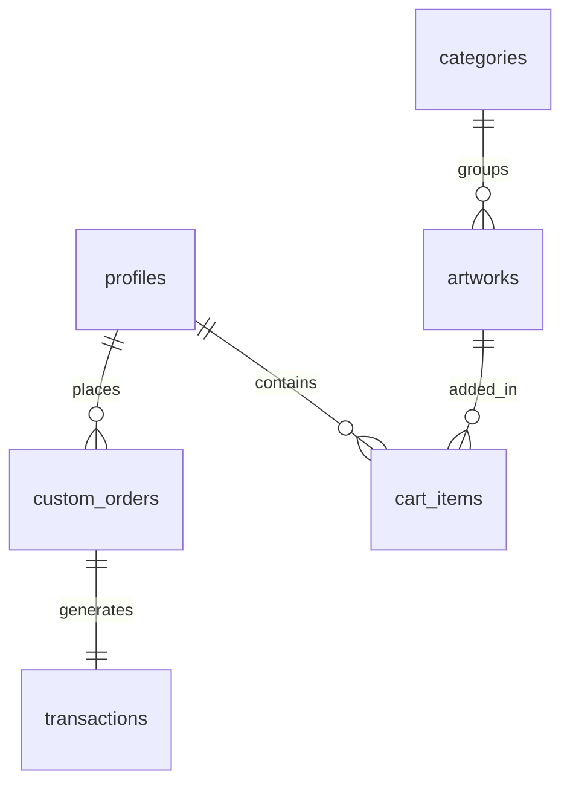

# Database Architecture Schema (Supabase/PostgreSQL) - AURA Gallery

This document defines the schema proposed for Phase 2.

---

## 1. Entity Relationship Overview



---

## 2. Table Definitions

### 1. `profiles`
Tracks user accounts linked to Supabase Authentication.
```sql
CREATE TABLE public.profiles (
    id UUID REFERENCES auth.users ON DELETE CASCADE PRIMARY KEY,
    email VARCHAR(255) NOT NULL,
    full_name VARCHAR(255),
    avatar_url TEXT,
    shipping_address JSONB,
    created_at TIMESTAMP WITH TIME ZONE DEFAULT TIMEZONE('utc'::text, NOW()) NOT NULL,
    updated_at TIMESTAMP WITH TIME ZONE DEFAULT TIMEZONE('utc'::text, NOW()) NOT NULL
);
```

### 2. `categories`
Groups artworks into Paintings, Calligraphy, or Sketches.
```sql
CREATE TABLE public.categories (
    id SERIAL PRIMARY KEY,
    name VARCHAR(100) NOT NULL UNIQUE,
    slug VARCHAR(100) NOT NULL UNIQUE,
    description TEXT,
    created_at TIMESTAMP WITH TIME ZONE DEFAULT TIMEZONE('utc'::text, NOW()) NOT NULL
);
```

### 3. `artworks`
Houses the metadata and imagery for pieces available in the gallery.
```sql
CREATE TABLE public.artworks (
    id UUID DEFAULT gen_random_uuid() PRIMARY KEY,
    category_id INT REFERENCES public.categories(id) ON DELETE RESTRICT NOT NULL,
    title VARCHAR(255) NOT NULL,
    artist VARCHAR(255) NOT NULL,
    price NUMERIC(10, 2) NOT NULL CHECK (price >= 0),
    dimensions VARCHAR(100) NOT NULL,
    medium VARCHAR(255) NOT NULL,
    year INT NOT NULL,
    image_url TEXT NOT NULL,
    description TEXT,
    stock INT DEFAULT 1 CHECK (stock >= 0),
    featured BOOLEAN DEFAULT false,
    slug VARCHAR(255) NOT NULL UNIQUE,
    created_at TIMESTAMP WITH TIME ZONE DEFAULT TIMEZONE('utc'::text, NOW()) NOT NULL
);
```

### 4. `custom_orders`
Stores custom artwork commission requests.
```sql
CREATE TABLE public.custom_orders (
    id UUID DEFAULT gen_random_uuid() PRIMARY KEY,
    profile_id UUID REFERENCES public.profiles(id) ON DELETE SET NULL,
    customer_name VARCHAR(255) NOT NULL,
    customer_email VARCHAR(255) NOT NULL,
    medium VARCHAR(100) NOT NULL,
    dimensions VARCHAR(100) NOT NULL,
    description TEXT NOT NULL,
    status VARCHAR(50) DEFAULT 'pending' CHECK (status IN ('pending', 'approved', 'in_progress', 'completed', 'cancelled')),
    quote_amount NUMERIC(10, 2),
    created_at TIMESTAMP WITH TIME ZONE DEFAULT TIMEZONE('utc'::text, NOW()) NOT NULL
);
```

### 5. `cart_items`
Manages transient shopping states.
```sql
CREATE TABLE public.cart_items (
    id UUID DEFAULT gen_random_uuid() PRIMARY KEY,
    profile_id UUID REFERENCES public.profiles(id) ON DELETE CASCADE,
    artwork_id UUID REFERENCES public.artworks(id) ON DELETE CASCADE,
    quantity INT DEFAULT 1 CHECK (quantity > 0),
    created_at TIMESTAMP WITH TIME ZONE DEFAULT TIMEZONE('utc'::text, NOW()) NOT NULL
);
```
