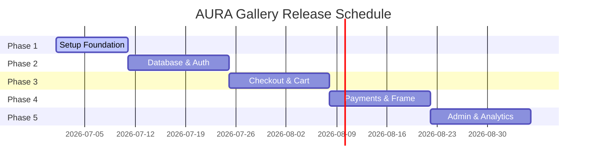

# Project Release Roadmap - AURA Gallery

This document details the development lifecycle for AURA, detailing the milestones for subsequent releases.

---

## 📅 Roadmap Overview

---

## 🛠️ Phases Breakdown

### Phase 1: Foundation (Completed)
- Set up directory layouts for backend stubs and Next.js frontend.
- Establish the design language, font definitions, and luxury theme color codes.
- Create atomic UI controls, skeletons, and layouts.
- Build visual sections (Navbar, Footer, Hero, Curated Categories, and Collection Grid).
- Implement routes with placeholders.

### Phase 2: Database & Auth Integration (Pending)
- Deploy PostgreSQL database tables on Supabase.
- Integrate Supabase Authentication in Next.js, replacing placeholder middleware.
- Connect the frontend routes to query real records from database tables, removing mock data arrays.

### Phase 3: Cart Management & Commission Inquiries (Pending)
- Implement shopping bag client context to track selections.
- Connect commission forms to write inquiries to the database.
- Develop the backend API to handle automated notification emails for new curator inquiries.

### Phase 4: Payments & Shipping (Pending)
- Integrate Stripe checkout flows.
- Configure webhooks to process payments, update inventory levels, and send purchase receipts.
- Implement delivery tracking.

### Phase 5: Curator Admin Dashboard (Pending)
- Develop an authentication-protected admin dashboard for gallery staff.
- Build controls for managing inventory, responding to custom order inquiries, and reviewing sales analytics.
